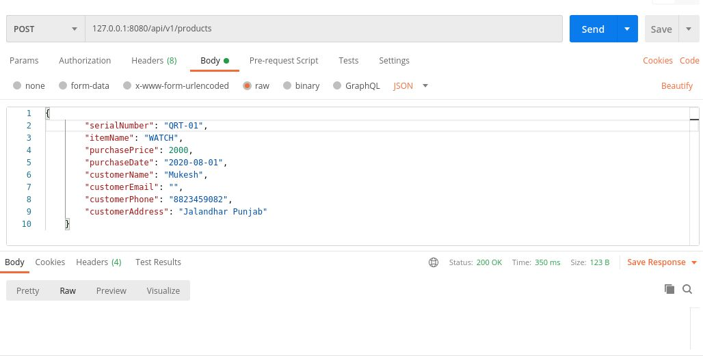

# Product Registration API
Product Registration Application api built with Spring Boot.
## Features
1. List all Products
2. Get individual product
3. Create product

## **Create API Screen:**
   
   
## **List all products API Screen:**
   

## **List a product API Screen:**
   
      
